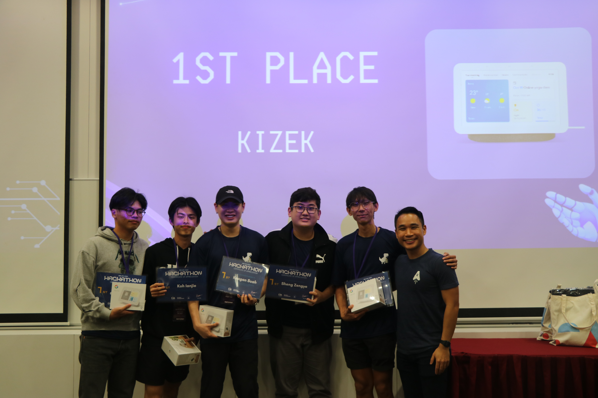
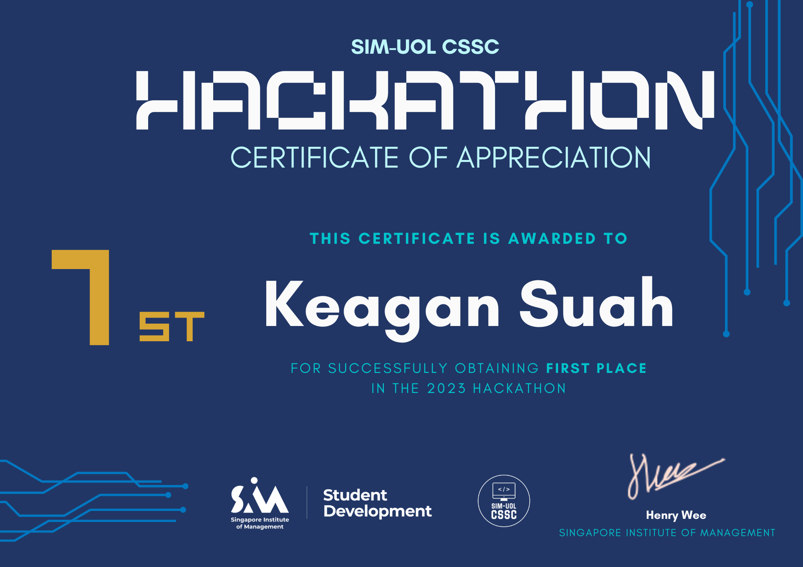
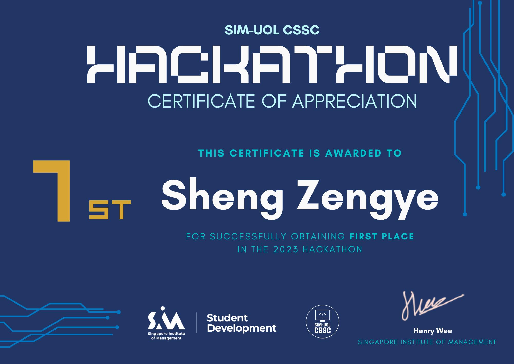
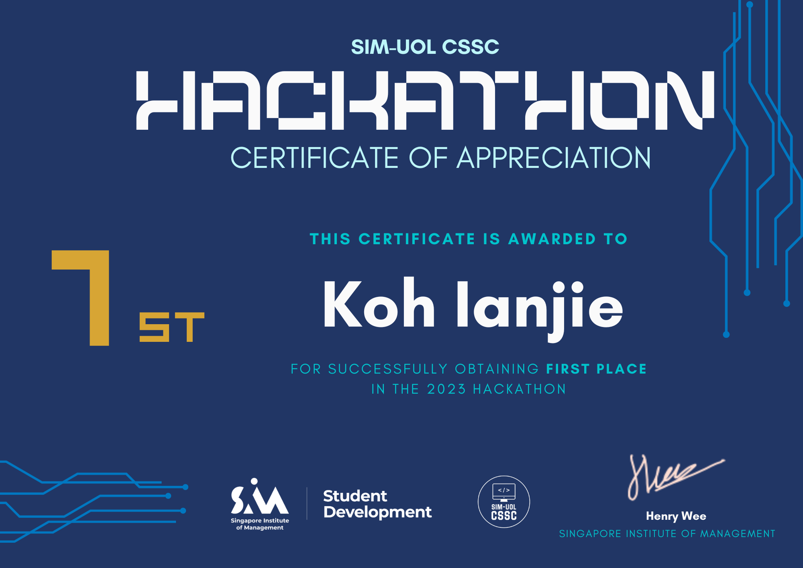
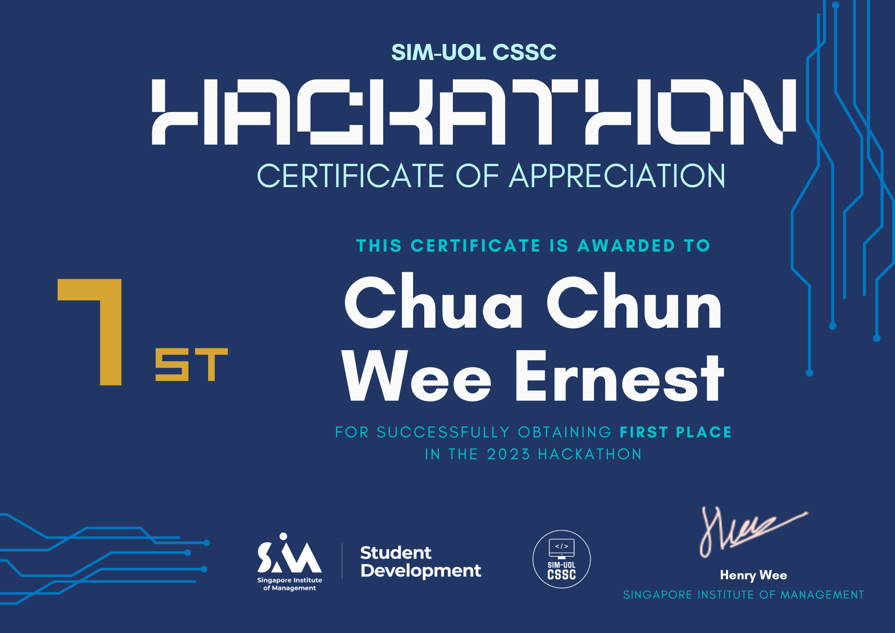
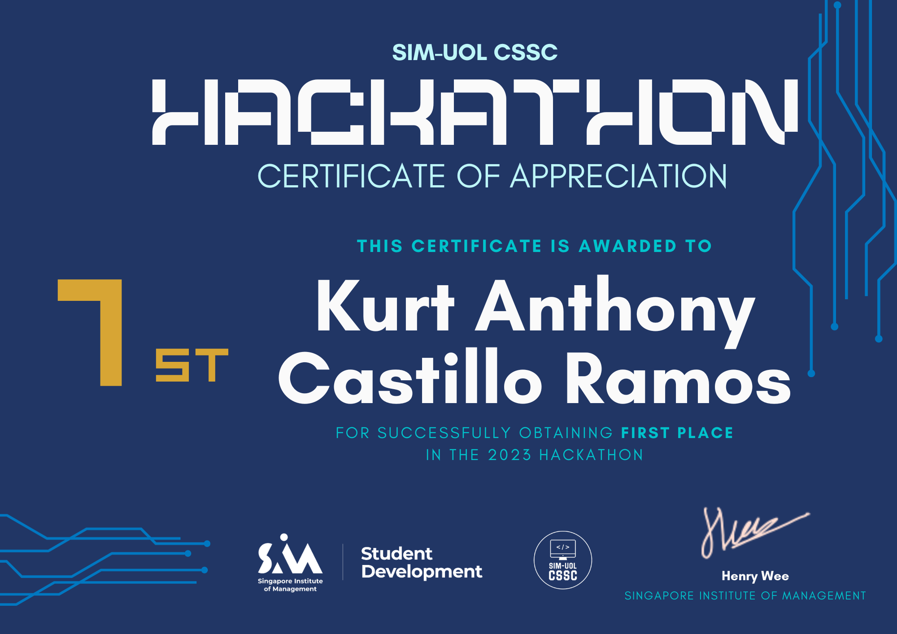

# Hackathon Project Name: E-Commerce Website - UOL-CS Hackathon Winner 🏆

Congratulations Team KIZEK on Winning First Place in the SIM-UOL-CS Hackathon!

## Overview
KIZEK Wear is a frontend-only e-commerce website dedicated to female sportswear. This project was developed as part of the Hackathon Team "KIZEK", where our team secured the first-place position by creating an innovative and visually stunning user interface for a female sportswear marketplace.

## Features
- **Modern and Responsive Design:** Our design focuses on a clean, modern layout that ensures an excellent user experience across various devices.
- **Intuitive Navigation:** Seamless navigation and user-friendly interface for easy browsing and shopping.
- **Dynamic Product Showcase:** Engaging product displays with high-quality images and detailed information.
- **User-Centric Experience:** Designed to cater specifically to the needs and preferences of female sportswear shoppers.
- **Functionality:** Functions that allow users to add items to cart, remove from cart, viewing differenct colours on product.

## Team Members
- Keagan Suah - Group Leader
- Sheng Zengye - Accessibility Specialist
- Koh IanJie - Designer
- Chua Ernest - Copywriter
- Kurt Castillo - Reacher

## Achievements
- **First Place:** Awarded the first-place position in the SIM-UOL-CS Hackathon.
- **Innovative Design:** Recognized for our innovative and visually appealing frontend design for the FemFit Wear e-commerce website.
- **Functionality and Completeness:** Recognized for our fully functional website that excellently fulfil it's intended purpose

## Getting Started
To explore the project, simply follow these steps:

1. Clone the repository: `git clone https://github.com/your-username/your-repo.git`
2. Pip install Django
3. Open the `hackathon_uol_2023` file in your terminal.
4. Run the `manage.py` file by typing `python manage.py runserver`

## Technologies Used
- HTML
- CSS
- JavaScript
- Python
- Django Framework

## Certificates of Appreciations

## Acknowledgments
We would like to express our gratitude to SIM-UOL-CSSC for providing this exciting opportunity and recognition.

Feel free to reach out for any inquiries or collaborations!

suahkeagan@gmail.com

Thank you all for your support!

---
